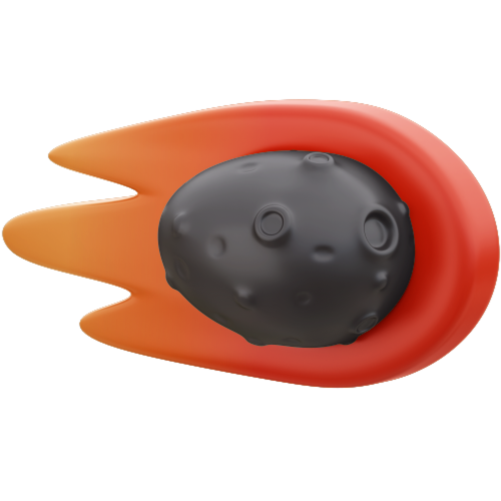

# Mouse move Parallax elements using Parallax.js


## Installation

Use [CDN]([https://cdnjs.cloudflare.com/ajax/libs/wavesurfer.js/1.0.52/wavesurfer.min.js](https://cdnjs.cloudflare.com/ajax/libs/parallax/3.1.0/parallax.min.js)) or [Download]([https://unpkg.com/wavesurfer.js](https://github.com/wagerfield/parallax)) it.

```javascript
<script src="https://cdnjs.cloudflare.com/ajax/libs/parallax/3.1.0/parallax.min.js"></script>
```

## Usage

```html
<div class="items__layer" data-depth="0.85">
    <div class="items__item">
        
    </div>
</div>
```


## Subscribe
Please subscribe [CodeWithNiranjan](https://youtube.com/channel/UCzfQyi4_E-lS9ps3fVb0jlA)

<h1>Thank You</h1>
